# Lecture 09 - ECDSA - Elliptic curve public key encryption

Just one set of lectures this week - 5 parts.

# Videos (part 1 .. 5 )

[Elliptic Curve(EC) Intro - https://youtu.be/J8WUvMcq0wA](https://youtu.be/J8WUvMcq0wA) 
[EC pt1 - https://youtu.be/9lhvilCm0Js](https://youtu.be/9lhvilCm0Js) 
[EC pt2 - https://youtu.be/BnYSv1ew_-4](https://youtu.be/BnYSv1ew_-4) 
[EC pt3 - https://youtu.be/TyFALT9MoKw](https://youtu.be/TyFALT9MoKw) 
[EC pt4 - https://youtu.be/ih2FkqsYpKA](https://youtu.be/ih2FkqsYpKA) 

From Amazon S3 - for download (same as youtube videos)

[Elliptic Curve(EC) Intro](http://uw-s20-2015.s3.amazonaws.com/4010-L09-pt0-EC-and-ECDSA-intro.mp4) 
[EC pt1](http://uw-s20-2015.s3.amazonaws.com/4010-L09-pt1-ECDSA.mp4) 
[EC pt2](http://uw-s20-2015.s3.amazonaws.com/4010-L09-pt2-add-double-mul.mp4) 
[EC pt3](http://uw-s20-2015.s3.amazonaws.com/4010-L09-pt3-discreet.mp4) 
[EC pt4](http://uw-s20-2015.s3.amazonaws.com/4010-L09-pt4-examle.mp4) 

# Some history.

The biggest problem in cryptography before 1977 was key distribution.

In 1977 public key cryptography was invented.  IN 1983 it was patented.  In 1988 an adequate key was 100 decimal digits.
Computers were a touch slower - today you need 8k to 16k digits.  That is slow.

The system really only is used to solve the key distribution problem - not actually to encrypt content.

This is the simple form:
A and B both have Public/Private key pairs.   B wants to communicate with A.   B uses A's public key to encrypt a message
32 bytes long to send to A.  The message is a random 32 byte AES encryption key. A uses the "private" part of the key to decrypt  the message and get the key.
A uses B's private key to send back a new message with 32 bytes of data.   The 32 bytes are a random AES key.
B uses her own private key to decrypt the message.  Now both sizes have AES keys.  They use AES, 1000 times
faster, to send back and forth encrypted data.

A real key exchange is more complex than this - but this is the basic idea.

There are also key exchanges where the key is never transmitted.  That is better for key exchange.  It requires the use of a zero knowledge proof combined
with a bunch of algebra and no key transmission is done at all.  Both sides end up with the same a 32 byte AES key.

Also to make this secure you have to add a bunch of wrappers around the transmission like a Nonce and signature of validity like CBC.   

The idea is the same.   All the real data is encrypted using AES, the key exchange is done using the public/private key pairs.

This is the basic idea of TLS 1.3, the underlying system for HTTPS.  TLS adds the additional validation that the keys are checked
in a hierarchy with a signature where the signature can be validated to be from a certain source.  This is the "hierarchy of Trust"
and why we trust the TLS to be from the original domain.

# RSA is easy to understand.

RSA even has articles [on it in the Atlantic Magazine](https://www.theatlantic.com/magazine/archive/2002/09/a-primer-on-public-key-encryption/302574/).

You can get it down to a simple set of explanations with just some math.

The security is based on factoring of large numbers.  *Mathematicians consider factoring to be a difficult` problem.*   I find the general understatement of 'difficult to be very funny.

Another good source [is Cloudflare's primer on EC](https://blog.cloudflare.com/a-relatively-easy-to-understand-primer-on-elliptic-curve-cryptography/) - and I have taken the 2 animations
from them. 

EC is used as the system in Bitcoin, Ethereum and most other blockchains.

# EC and ECDSA Encryption

How ECDSA works under the covers

Eliptic Curve Function

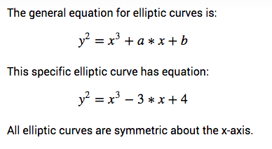

Graphed 

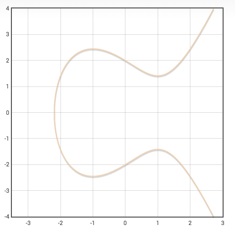

Good EC, bad EC, addition.

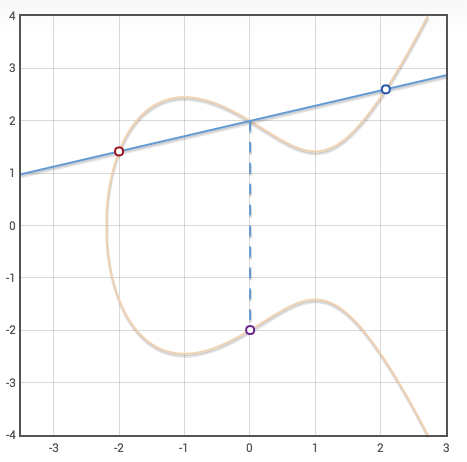

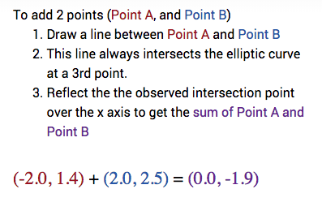

Doubleling of a value.

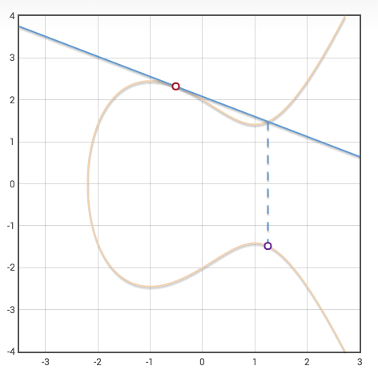

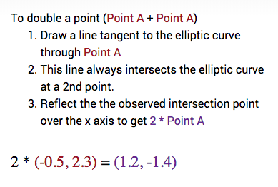

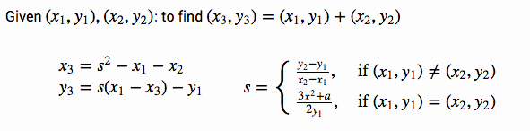

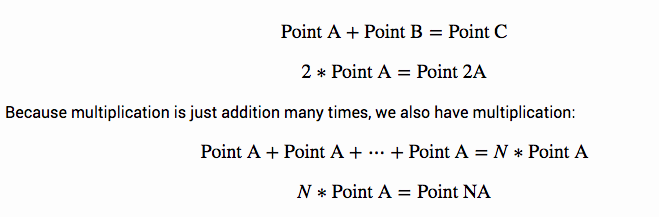

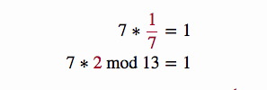

As integers we get:

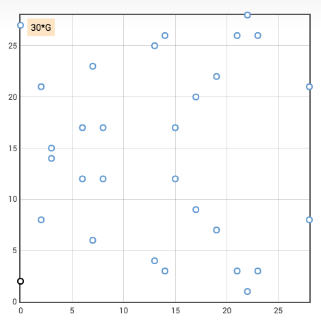

Now we can use a modulo system for this:

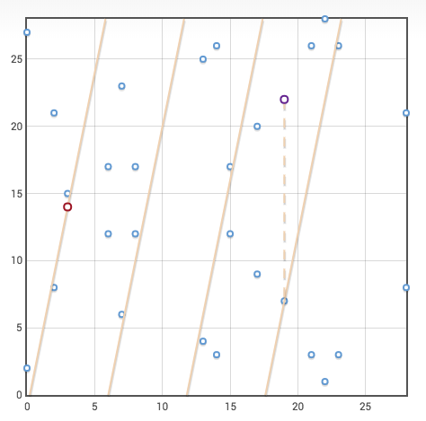

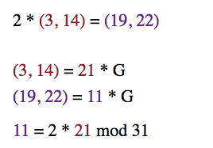

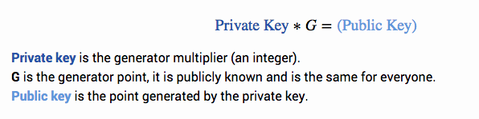

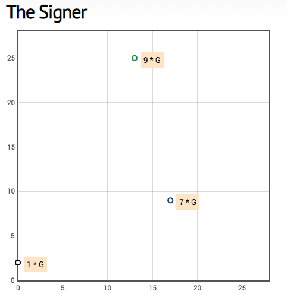

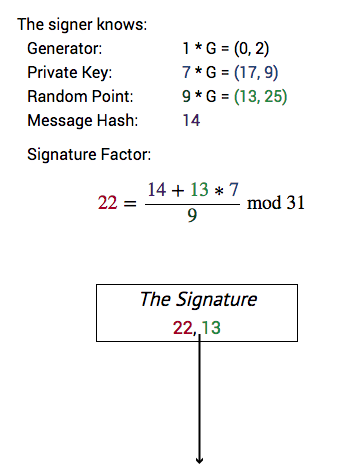

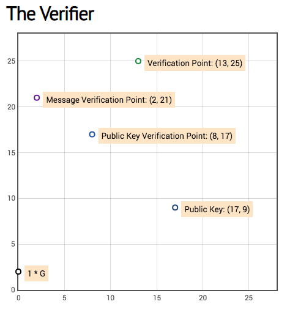

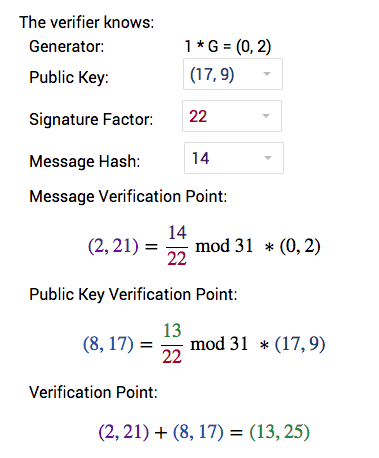

