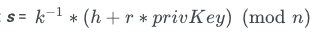
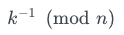
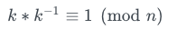
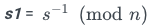

# Digit ital Signatures

## News

I would assume that we will be moving to an online / zoom based class.

1. Install zoom on your system.
2. Use the following link:
[https://uwyo.zoom.us/j/5976304542](https://uwyo.zoom.us/j/5976304542)
Unless I send out a new better link.


## Digital Signatures In Our Code

```
// GenerateSignature uses a keyfile and password to sign a message.  If the input message is "" then a random message
// will be generated.  The messgae and the signature are returned.
func GenerateSignature(keyFile, password string, inMessage []byte) (message, signature string, err error) {
	data, err := ioutil.ReadFile(keyFile)
	if err != nil {
		return "", "", fmt.Errorf("unable to read keyfile %s Error:%s", keyFile, err)
	}
	key, err := keystore.DecryptKey(data, password)
	if err != nil {
		return "", "", fmt.Errorf("unable to decrypt %s Error:%s", keyFile, err)
	}
	if len(inMessage) == 0 {
		inMessage, err = GenRandBytes(20)
		if err != nil {
			return "", "", fmt.Errorf("unable to generate random message Error:%s", err)
		}
	}
	message = hex.EncodeToString(inMessage)
	rawSignature, err := crypto.Sign(signHash(inMessage), key.PrivateKey) // Sign Raw Bytes, Return hex of Raw Bytes
	if err != nil {
		return "", "", fmt.Errorf("unable to sign message Error:%s", err)
	}
	signature = hex.EncodeToString(rawSignature)
	return message, signature, nil
}
```

What needs to be passed to the verifier:

1. The Message - because we will have some content that needs to be processed.
2. The Signature - to verify the message.
3. The Hash of the Message - that will need to be checked by the receiver to verify is voracity. (Strictly speaking this is not necessary.  This has to be generated by the receiver anyhow.  But if it is sent then you have a very good way of testing that the message is not corrupted.)
4. Person sending the message (the public key or account number reflecting the public key)

## How they work

### To Sign

The Spec is RFC 6979.  This has the details of the algoithm.

Input is the message and a private key.

Output is the signature - a pair of integers {r,s}.  The integers will be 2 times the size of the private key.  So a 32 byte private key produces a 64 byte signature.
Also most signature schemes pass a single 1 byte value that indicates the quadrent that the signature is in and it is 0,1,2,3 - but only 0 and 1 values are
valid in the real world.
This is the ElGamal algorithm.  

1.  Calculate the message hash, using a cryptographic hash function like SHA-256
```
h = hash(msg)
```
2. Generate securely a random number `k` in the range `[1..n-1]`.  This range is `1` ... `2**256` for a 32bit ECDSA.
3. Note: for a deterministic-ECDSA, the value k is HMAC-derived from `h + private key`.  This is specified in the standard.
4. Calculate the random point `R = k * G` and take its x-coordinate: `r = R.x`.
5. Calculate the signature proof: 
	- The modular inverse  is an integer, such that 
	- If you don't get a good modular inverse go back to (4) and generate a new random number.
6. Return the signature {r,s}.

The generated signature {r,s} is a pair of integers. It encodes the random point `R = k * G`, along with a proof `s`, confirming that the signer knows the message `h` and the private key.
The proof s is by idea verifiable using the corresponding public key.

### To Verify

Input: Use as input the signature, {r,s}, the message and the public key of the signer.  Also the 'h' value from the source.

Output: Valid or invalid boolean value.

1. Calculate the message hash, `h' = hash(msg)` using the same function.  If the hash is passed from the source - check that the hashes match.  `h' == h`.  If they do not match then return `false` done.
2. Calculate the modular inverse of the signature proof: 
3. Recover the random point used during the signing: `R' = (h' * s1) * G + (r * s1) * public key`
4. Take from `R'` its x-coordinate: `r' = R'.x`
5. Determine the result true/false by comparing whether `r' == r` from the passed `r` in the data.

The general idea of the signature verification is to recover the point R' using the public key and check whether it is same point R, generated randomly during the signing process.
